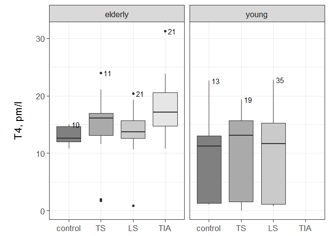
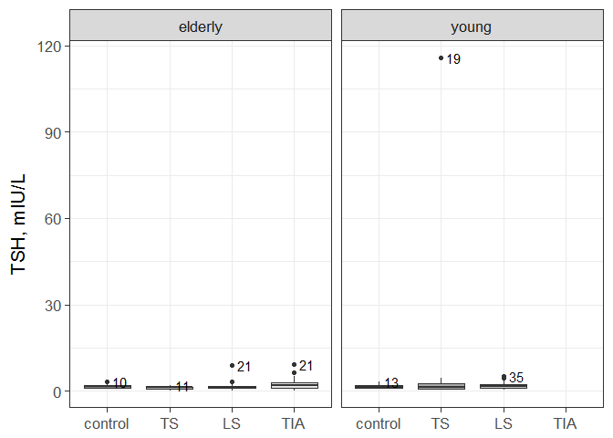
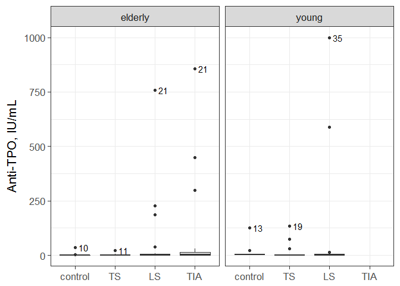
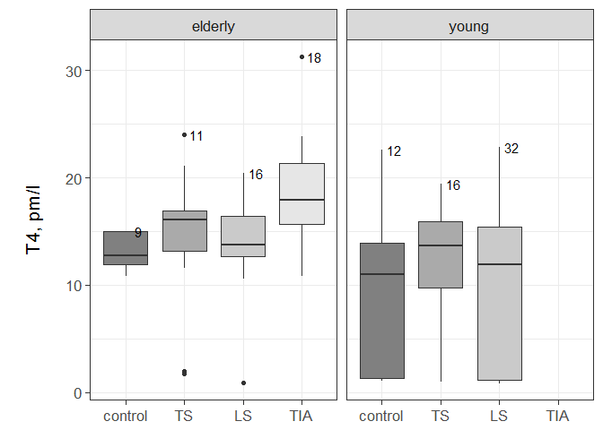
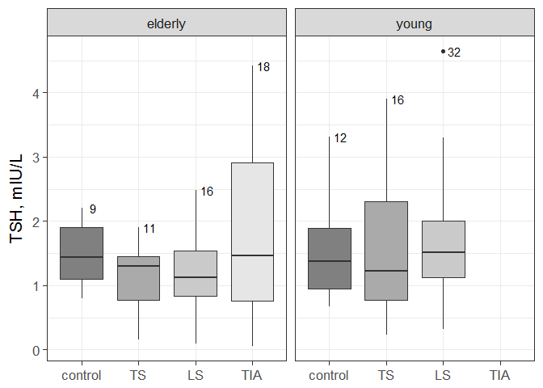
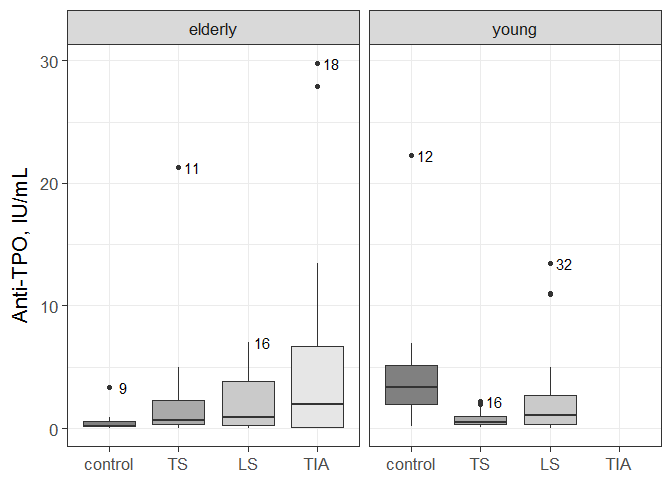

## About

Statistical analysis performed as a part of research published in medical a research journal. 

N.V. Halinouskaya, _S.V. Samsonau_, N.N. Usava, V.B. Smychek, “Thyroid Hormone Status in Stroke and Transient Ischemic Attack Patients”, Neurologijos Seminarai, Volume 19, Issue 3, 207, 2015

The paper can be found on the [website of the journal](http://www.neuroseminarai.lt/wp-content/uploads/2017/02/Neuro_2015_Nr3_207-209.pdf)


## Load data


```r
library(data.table)
library(ggplot2)

#open file
DT <- fread("./dataPreparation//data_repaired_translitarated.csv", colClasses=rep("character", 977))
#dim(DT)

#choose coloumns needed
chosen.col <- c(184, 185, 186, 28, 16, 6) 
print("Names of chosen coloumns are:")
```

```
## [1] "Names of chosen coloumns are:"
```

```r
names(DT)[chosen.col]
```

```
## [1] "T4"                "TTT"               "AT TP"            
## [4] "otlichija BI i MI" "vozrast god"       "pol"
```

```r
#change names to readable
DTsub <- subset(DT, select=chosen.col) 
setnames(DTsub, c("T4", "TSH", "ATPO", "group", "age", "gender"))
print("changed to :")
```

```
## [1] "changed to :"
```

```r
names(DTsub)
```

```
## [1] "T4"     "TSH"    "ATPO"   "group"  "age"    "gender"
```

```r
#variables for plots
variable.names <- c("T4", "TSH", "ATPO")
var.plot.notation <- c("T4, pm/l", "TSH, mIU/L", "Anti-TPO, IU/mL")
```

## Prepare data


```r
#make data numeric
num.var <- c("T4", "TSH", "ATPO", "age")
DTsub[, eval(num.var):=lapply(.SD, as.numeric), .SDcols=num.var]

#make appropriate factor levels
group.values <- c("1", "2", "3", "90", "7")
new.group.values <- c("LS", "TS", "TIA", "control", "control")

library(plyr)
DTsub[, group:=mapvalues(group, from=group.values, to=new.group.values)]
DTsub <- DTsub[group %in% new.group.values, ]
DTsub[ , group := factor(group)]
DTsub[ , group := factor(group, levels(group)[c(1, 4, 2, 3)])]

#gender
DTsub[, gender:=mapvalues(gender, from=c("m", "zh"), to=c("male", "female"))]

#age
DTsub[age<=45, age.cohort:="young"]
DTsub[age>45, age.cohort:="elderly"]
DTsub <- DTsub[age.cohort %in% c("young", "elderly"), ]

#all data for young, for transient ischemic attack are NA except one that is 0. So we do not use them
DTsub <- DTsub[! (group=="TIA" & age.cohort=="young"), ]

#use only the data where all records available and refactor
DTsub <- na.omit(DTsub)
DTsub[, gender:=factor(gender)]
DTsub[, age.cohort:=factor(age.cohort)]
```


```r
print.overview <- function(dt){#function to print overview of data
    #summary(DTsub)
    print("data summary---")
    print( summary(dt) )
        
    print("Male and Female separatelly---")
    data.overview <- dt[, list(.N, mean(age), sd(age)), by=list(age.cohort, group, gender)]
    setnames(data.overview, c("group", "V2", "V3"), c("group", "age.mean", "age.sd"))
    setkey(data.overview, age.cohort, group, gender)
    print( unique( data.overview ) )

    print("Male and Female together---")
    data.overview <- dt[, list(.N, mean(age), sd(age)), by=list(age.cohort, group)]
    setnames(data.overview, c("group", "V2", "V3"), c("group", "age.mean", "age.sd"))
    setkey(data.overview, age.cohort, group)
    print( unique( data.overview ) )

    }

print.overview(DTsub)
```

```
## [1] "data summary---"
##        T4             TSH               ATPO             group   
##  Min.   : 0.01   Min.   :  0.054   Min.   :   0.00   control:23  
##  1st Qu.:10.80   1st Qu.:  0.985   1st Qu.:   0.30   TS     :30  
##  Median :13.65   Median :  1.475   Median :   1.17   LS     :56  
##  Mean   :12.45   Mean   :  2.719   Mean   :  47.18   TIA    :21  
##  3rd Qu.:16.25   3rd Qu.:  2.315   3rd Qu.:   5.00               
##  Max.   :31.30   Max.   :115.900   Max.   :1000.00               
##       age           gender     age.cohort
##  Min.   :17.00   female:72   elderly:63  
##  1st Qu.:40.00   male  :58   young  :67  
##  Median :45.00                           
##  Mean   :49.94                           
##  3rd Qu.:59.00                           
##  Max.   :90.00                           
## [1] "Male and Female separatelly---"
##     age.cohort   group gender  N age.mean    age.sd
##  1:    elderly control female  4 56.00000  4.320494
##  2:    elderly control   male  6 54.00000  5.253570
##  3:    elderly      TS female  5 60.80000  9.909591
##  4:    elderly      TS   male  6 61.33333 12.420413
##  5:    elderly      LS female 11 68.00000 11.575837
##  6:    elderly      LS   male 10 56.80000  7.969386
##  7:    elderly     TIA female 18 67.83333 14.805603
##  8:    elderly     TIA   male  3 74.33333  6.429101
##  9:      young control female  9 30.44444  5.547772
## 10:      young control   male  4 31.25000  6.344289
## 11:      young      TS female  4 36.25000  9.569918
## 12:      young      TS   male 15 39.73333  5.133457
## 13:      young      LS female 21 38.95238  6.719198
## 14:      young      LS   male 14 39.57143  7.324504
## [1] "Male and Female together---"
##    age.cohort   group  N age.mean    age.sd
## 1:    elderly control 10 54.80000  4.756282
## 2:    elderly      TS 11 61.09091 10.793095
## 3:    elderly      LS 21 62.66667 11.332843
## 4:    elderly     TIA 21 68.76190 13.996088
## 5:      young control 13 30.69231  5.543534
## 6:      young      TS 19 39.00000  6.155395
## 7:      young      LS 35 39.20000  6.867657
```


## Plot

### With outliers

```r
give.n <- function(x){ #function for positioning numbers on plots
  return(data.frame(y = max(x), label = paste0("       ",length(x))))
}

for(variable in variable.names){
    plot.var <- ggplot(data=DTsub,
                       aes(x=group, y =get(variable), fill=group)) + geom_boxplot() +
        facet_grid(.~ age.cohort, drop=T, space="free_x") +
        theme_bw(16) +
        theme(legend.position="none", axis.title.x = element_blank()) + 
        ylab(var.plot.notation[variable==variable.names]) +
        stat_summary(fun.data = give.n, geom = "text") +
        scale_fill_grey(start = 0.5, end = .9)

    print(plot.var)

    tiff(paste0("outfile",variable,"wo.out.tiff"), res=300, height=5, width=6.80, units="in")
    print(plot.var)
    dev.off()    
}
```

<!-- --><!-- --><!-- -->
 
 
### Without outliers
Here we are cuttiong out records for which values of variables are 5 IQR (Interquartile ranges) lower or higher relative to 1st and 3rd quartiles correspondingly.


```r
remove_outliers <- function(x, na.rm = TRUE, countIQR = 5, ...) {
    H <- countIQR * IQR(x, na.rm = na.rm)
    qrts <- quantile(x, probs=c(.25, .75), na.rm = na.rm, ...)
    y <- x
    y[x < (qrts[1] - H)] <- NA
    y[x > (qrts[2] + H)] <- NA
    y
}

DTsub.wout <- data.table(DTsub)

DTsub.wout[age.cohort=="young", eval(variable.names):=lapply(.SD, remove_outliers), .SDcols=variable.names]
DTsub.wout[age.cohort=="elderly", eval(variable.names):=lapply(.SD, remove_outliers), .SDcols=variable.names]

DTsub.wout <- na.omit(DTsub.wout)
```


```r
print.overview(DTsub.wout)
```

```
## [1] "data summary---"
##        T4             TSH             ATPO            group   
##  Min.   : 0.80   Min.   :0.054   Min.   : 0.000   control:21  
##  1st Qu.:10.80   1st Qu.:0.915   1st Qu.: 0.225   TS     :27  
##  Median :13.80   Median :1.360   Median : 0.925   LS     :48  
##  Mean   :12.71   Mean   :1.532   Mean   : 2.922   TIA    :18  
##  3rd Qu.:16.82   3rd Qu.:1.935   3rd Qu.: 3.078               
##  Max.   :31.30   Max.   :4.651   Max.   :29.800               
##       age           gender     age.cohort
##  Min.   :17.00   female:60   elderly:54  
##  1st Qu.:39.00   male  :54   young  :60  
##  Median :45.00                           
##  Mean   :49.43                           
##  3rd Qu.:59.00                           
##  Max.   :90.00                           
## [1] "Male and Female separatelly---"
##     age.cohort   group gender  N age.mean    age.sd
##  1:    elderly control female  3 56.00000  5.291503
##  2:    elderly control   male  6 54.00000  5.253570
##  3:    elderly      TS female  5 60.80000  9.909591
##  4:    elderly      TS   male  6 61.33333 12.420413
##  5:    elderly      LS female  8 68.62500 12.557724
##  6:    elderly      LS   male  8 56.25000  8.795291
##  7:    elderly     TIA female 15 68.00000 15.487322
##  8:    elderly     TIA   male  3 74.33333  6.429101
##  9:      young control female  8 30.12500  5.841661
## 10:      young control   male  4 31.25000  6.344289
## 11:      young      TS female  2 28.00000  1.414214
## 12:      young      TS   male 14 39.35714  5.108171
## 13:      young      LS female 19 39.31579  6.633690
## 14:      young      LS   male 13 39.15385  7.448111
## [1] "Male and Female together---"
##    age.cohort   group  N age.mean    age.sd
## 1:    elderly control  9 54.66667  5.024938
## 2:    elderly      TS 11 61.09091 10.793095
## 3:    elderly      LS 16 62.43750 12.269033
## 4:    elderly     TIA 18 69.05556 14.432285
## 5:      young control 12 30.50000  5.744563
## 6:      young      TS 16 37.93750  6.147832
## 7:      young      LS 32 39.25000  6.858007
```


```r
theme_set(theme_grey(base_size = 18))
for(variable in variable.names){
    
    plot.var <- ggplot(data=DTsub.wout,
                       aes(x=group, y =get(variable), fill=group)) + geom_boxplot() +
        theme_bw(16) +
        facet_grid(.~ age.cohort, drop=T, space="free_x") +
        theme(legend.position="none", axis.title.x = element_blank()) + 
        ylab(var.plot.notation[variable==variable.names]) +
        stat_summary(fun.data = give.n, geom = "text")+
        scale_fill_grey(start = 0.5, end = .9)
    
    print(plot.var)

    tiff(paste0("outfile",variable,"wo.out.tiff"), res=300, height=5, width=6.80, units="in")
    print(plot.var)
    dev.off()
}
```

<!-- --><!-- --><!-- -->


## Statistics (outliers removed)

First let us see if all groups are identical. In order to do this we could use ANOVA test if  

 * the data would be independent (yes in this case)
 * normally distributed (no in this case). ANOVA can be robust to not normal data if sample sizes are equal (no in this case).
 * have a identical variances (no for elderly patients - checked bellow with Levene's Test).


```r
print.test <- function(dt, age.cohort.v, variable, statistics.v, test="kruskal"){
        print(age.cohort.v)
        print(variable)
        DTtemp <- na.omit(dt[age.cohort==age.cohort.v, list(get(variable), group)])
        setnames(DTtemp, "V1", eval(variable))
        
        DTstat <- DTtemp[, list(.N, mean(get(variable)), var(get(variable)), median(get(variable))), 
                         by=group]
        setnames(DTstat, c("N", "V2", "V3", "V4"), c("# of observations", "mean", "variance", "median"))
        
        if(test == "levene"){
            library(car)
            print( leveneTest(get(variable) ~ group, data=DTtemp) )
        }
        if(test == "kruskal"){
            print( DTstat  )    
            print(  kruskal.test(get(variable) ~ group, data=DTtemp)  )
        }
}
for(age.cohort.v in c("elderly", "young")){
    for(variable in variable.names){
        print.test(DTsub.wout, age.cohort.v, variable, test="levene")        
    }    
}
```

```
## [1] "elderly"
## [1] "T4"
```

```
## Loading required package: carData
```

```
## Levene's Test for Homogeneity of Variance (center = median)
##       Df F value Pr(>F)
## group  3  1.4371 0.2431
##       50               
## [1] "elderly"
## [1] "TSH"
## Levene's Test for Homogeneity of Variance (center = median)
##       Df F value   Pr(>F)   
## group  3  4.6391 0.006138 **
##       50                    
## ---
## Signif. codes:  0 '***' 0.001 '**' 0.01 '*' 0.05 '.' 0.1 ' ' 1
## [1] "elderly"
## [1] "ATPO"
## Levene's Test for Homogeneity of Variance (center = median)
##       Df F value Pr(>F)
## group  3   1.837 0.1524
##       50               
## [1] "young"
## [1] "T4"
## Levene's Test for Homogeneity of Variance (center = median)
##       Df F value Pr(>F)
## group  2  0.5746 0.5661
##       57               
## [1] "young"
## [1] "TSH"
## Levene's Test for Homogeneity of Variance (center = median)
##       Df F value Pr(>F)
## group  2  0.4572 0.6354
##       57               
## [1] "young"
## [1] "ATPO"
## Levene's Test for Homogeneity of Variance (center = median)
##       Df F value Pr(>F)
## group  2  2.2127 0.1187
##       57
```

Thus, in the case we should use Kruskal-Wallis test, which does not require from data to satisfy those conditions.


```r
for(age.cohort.v in c("elderly", "young")){
    for(variable in variable.names){
        print.test(DTsub.wout, age.cohort.v, variable, test="kruskal")        
    }    
}
```

```
## [1] "elderly"
## [1] "T4"
##      group # of observations     mean  variance median
## 1:     TIA                18 18.73889 21.753105  17.95
## 2:      LS                16 14.11250 20.373167  13.75
## 3:      TS                11 14.30000 48.166880  16.10
## 4: control                 9 13.08889  2.596111  12.70
## 
## 	Kruskal-Wallis rank sum test
## 
## data:  get(variable) by group
## Kruskal-Wallis chi-squared = 14.464, df = 3, p-value = 0.002337
## 
## [1] "elderly"
## [1] "TSH"
##      group # of observations     mean  variance median
## 1:     TIA                18 1.804667 1.8561308   1.46
## 2:      LS                16 1.210000 0.3495333   1.13
## 3:      TS                11 1.129091 0.3487291   1.30
## 4: control                 9 1.481111 0.2502861   1.44
## 
## 	Kruskal-Wallis rank sum test
## 
## data:  get(variable) by group
## Kruskal-Wallis chi-squared = 2.8448, df = 3, p-value = 0.4162
## 
## [1] "elderly"
## [1] "ATPO"
##      group # of observations      mean  variance median
## 1:     TIA                18 5.7255556 84.272203  1.935
## 2:      LS                16 2.1712500  6.275238  0.870
## 3:      TS                11 3.0600000 38.907600  0.660
## 4: control                 9 0.6166667  1.122125  0.160
## 
## 	Kruskal-Wallis rank sum test
## 
## data:  get(variable) by group
## Kruskal-Wallis chi-squared = 3.698, df = 3, p-value = 0.296
## 
## [1] "young"
## [1] "T4"
##      group # of observations     mean variance median
## 1:      TS                16 11.78937 43.96039  13.65
## 2:      LS                32  9.26375 51.46428  11.90
## 3: control                12 10.48750 64.72642  11.00
## 
## 	Kruskal-Wallis rank sum test
## 
## data:  get(variable) by group
## Kruskal-Wallis chi-squared = 1.5377, df = 2, p-value = 0.4635
## 
## [1] "young"
## [1] "TSH"
##      group # of observations     mean  variance median
## 1:      TS                16 1.529375 1.1537662   1.22
## 2:      LS                32 1.677375 0.8206844   1.52
## 3: control                12 1.576667 0.6569152   1.38
## 
## 	Kruskal-Wallis rank sum test
## 
## data:  get(variable) by group
## Kruskal-Wallis chi-squared = 0.92474, df = 2, p-value = 0.6298
## 
## [1] "young"
## [1] "ATPO"
##      group # of observations    mean   variance median
## 1:      TS                16 0.75375  0.4963183   0.50
## 2:      LS                32 2.64250 13.9706129   1.03
## 3: control                12 4.95750 33.5853477   3.35
## 
## 	Kruskal-Wallis rank sum test
## 
## data:  get(variable) by group
## Kruskal-Wallis chi-squared = 12.169, df = 2, p-value = 0.002278
```

We see there is at least one coulomn is different (p value < 0.05) for

 * elderly and T4
 * young and ATPO

Now we can use paired comparassion to find what exactly is statistically different inside these groups.
In order to do this we use post-hoc comparassion following Siegel and Castellan procedure.

#### Elderly cohort

```r
library(pgirmess)
kruskalmc(T4 ~ group, data=DTsub.wout[age.cohort=="elderly", ])
```

```
## Multiple comparison test after Kruskal-Wallis 
## p.value: 0.05 
## Comparisons
##               obs.dif critical.dif difference
## control-TS  12.489899     18.65530      FALSE
## control-LS   6.819444     17.29392      FALSE
## control-TIA 22.138889     16.94451       TRUE
## TS-LS        5.670455     16.25662      FALSE
## TS-TIA       9.648990     15.88441      FALSE
## LS-TIA      15.319444     14.26093       TRUE
```

```r
#kruskalmc(T4 ~ group, data=DTsub.wout[age.cohort=="elderly", ], cont='two-tailed')
```
We see strong evidence of a difference between

 * TIA and control
  
#### Young cohort

```r
kruskalmc(ATPO ~ factor(group), data=DTsub.wout[age.cohort=="young", ])
```

```
## Multiple comparison test after Kruskal-Wallis 
## p.value: 0.05 
## Comparisons
##              obs.dif critical.dif difference
## control-TS 23.218750     15.96610       TRUE
## control-LS 14.171875     14.15243       TRUE
## TS-LS       9.046875     12.80136      FALSE
```

```r
#kruskalmc(ATPO ~ factor(group), data=DTsub.wout[age.cohort=="young", ], cont='two-tailed')
```

We see here strong evidence of a difference between

 * TS and control
 * LS and control
